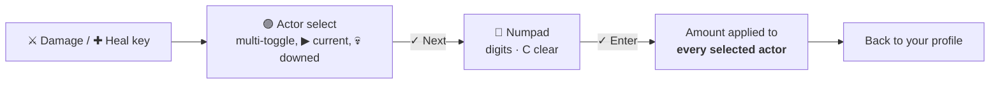
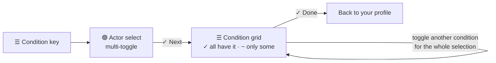
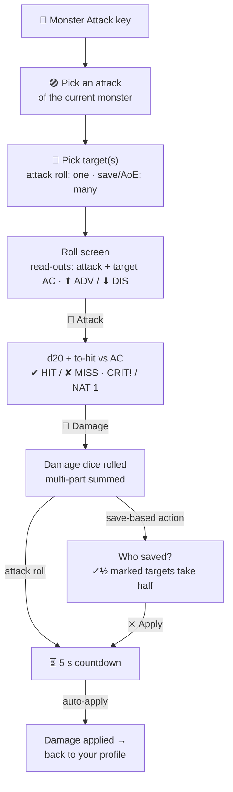
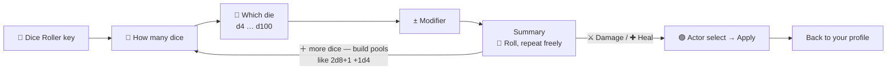
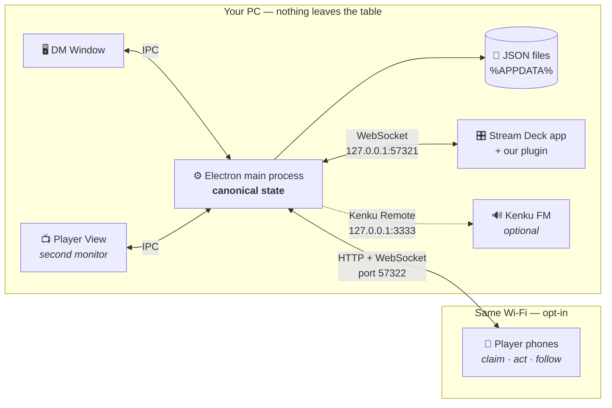

<div align="center">


**A Windows desktop app for Dungeon Masters to run D&D combat — with a second-monitor
Player View, a phone companion for the players, and an Elgato Stream Deck plugin for
hardware turn, HP and condition control.**

Everything runs on one machine. No network, no cloud, no accounts, no telemetry.

**[▶ Try the live demo](https://lil-dank.github.io/deck-of-many-turns/)** — the full app
in your browser, with a simulated player phone, a simulated Stream Deck and a combat
already in progress.

> <sub><em>The name is a play on the <strong>Deck of Many Things</strong>, D&D's most infamous
> magic item — chosen because this project started with a single idea: a D&D combat
> tracker whose flow of turns is controlled from an Elgato Stream <strong>Deck</strong>.</em></sub>

</div>

> [!NOTE]
> **This project was built with AI.** The application code, the Stream Deck plugin,
> the build tooling and this README were written by [Claude](https://claude.com/claude-code)
> (Anthropic), working from my specifications and iterative feedback across many rounds
> of review and testing. I directed the design, tested every feature against real
> hardware, and reviewed the result — but I did not hand-write the source.
> Treat it accordingly: it works and it is tested, and it has not had the kind of
> line-by-line human audit you might assume from a repository this size.

<div align="center">


<i>The DM window mid-combat — every column lines up, HP and AC sit right beside the
name, and the combat log keeps the story on the right.</i>

</div>

---

## Run the fight, not the software

You are three encounters deep, four players are talking at once, and the goblin that
went down two rounds ago is somehow still on the initiative list. **Deck of Many Turns
is the screen behind your DM screen.** Not a virtual tabletop — no maps, no tokens, no
grid. It holds initiative, hit points and conditions for a table sitting in the same
room as you, it opens in a second, and your campaign is plain JSON on your own disk.

Three things it does, and it does them at the table:

| | |
| --- | --- |
| ⚔️ **Run the fight** | Roll initiative for everyone or just the monsters, drag to settle ties, resolve attacks against AC with crits and save-for-half. Every action lands in a [combat log you can edit](#combat-log--archive) — correct a number and the HP follows it. |
| 📺 **Show your table** | A second monitor gets the [Player View](#player-view--and-the-chroma-key-setup): initiative order, no numbers on the monsters, just a bloodied glow as they drop. Built fully opaque and green-free, so it keys straight into OBS. |
| 📱 **Hand out the controls** | Players scan a QR code and get [their own character on their own phone](#player-phone-companion) — attacks, damage, healing, spell slots, gated to their turn. No app installs, no accounts, just your LAN. |

And a [Stream Deck](#stream-deck) beside your notes, if you have one: turn control, a
damage and healing numpad, multi-actor conditions and monster attack rolls on hardware
keys that render their own labels.

**Plays well with** [Elgato Stream Deck](#stream-deck) · [Kenku FM](#kenku-fm-audio) for
battle playlists and per-attack sound effects · [OBS](#player-view--and-the-chroma-key-setup)
· any phone with a browser · **English and Deutsch**, with game terms taken from the
SRD 5.2.1 in each language.

---

## Contents

- [What it does](#what-it-does)
- [Live demo](#live-demo)
- [Install](#install)
- [Using the app](#using-the-app)
  - [Campaigns](#campaigns) · [Party](#party) · [Monsters](#monsters) · [Spellbook](#spellbook--spellcasting) · [Encounters](#encounters) · [Combat](#combat) · [Player View](#player-view--and-the-chroma-key-setup)
  - [Combat log & archive](#combat-log--archive)
  - [Themes](#themes) · [Language](#language)
- [Player phone companion](#player-phone-companion)
- [Integrations](#integrations)
  - [Stream Deck](#stream-deck)
  - [Kenku FM audio](#kenku-fm-audio)
- [How it fits together](#how-it-fits-together)
- [Build from source](#build-from-source)
- [Releasing](#releasing)
- [Monster data & license](#monster-data--license)
- [Behaviour notes](#behaviour-notes)

---

## What it does

|  | |
| --- | --- |
| 🗂️ **Campaigns** | Run several tables from one install: party, encounters, combat and archive are scoped per campaign and [hot-swap from the sidebar](#campaigns) — even mid-combat. The monster library and settings stay shared. |
| 🧙 **Party & monster libraries** | PCs with HP/AC/initiative and their own attacks; 331 SRD 5.2.1 monsters importable in one click, with ability scores and fully structured attacks. Add your own too. |
| 📖 **Spellbook & spellcasting** | [All 339 SRD 5.2.1 spells](#spellbook--spellcasting) with full rules text in English *and* German. Spells attach to characters as castable actions; per-level spell slots with an upcast prompt, healing rolls, and Concentration tracking with automatic CON-save prompts. |
| 📋 **Encounter templates** | Reusable monster + quantity sets (4× Goblin Warrior, 1× Bugbear). Start combat straight from a card. |
| ⚔️ **Combat engine** | Initiative rolling (all, or monsters-only), drag-to-settle ties, live HP and conditions in an aligned table, mid-combat monster adds, attack resolution vs AC with crits and save-for-half. |
| 📺 **Player View** | Display-only second-monitor window. Monsters show no numbers — just a progressive "bloodied" reddening. Auto-fits any actor count. **Styled for chroma keying.** |
| 📱 **Player phone companion** | [Opt-in LAN webpage](#player-phone-companion) for players' phones: claim your character via QR code, follow initiative, deal damage/heal, roll your attacks — gated to your turn. No app installs. |
| 🎛️ **Stream Deck plugin** | Turn control, damage/heal numpad, multi-actor conditions, monster attack rolls, and a dice roller — all on hardware keys that render their own labels. |
| 📜 **Combat log & archive** | [Every action logged as cards](#combat-log--archive) — attack rolls with expandable dice breakdowns, casts, saves, conditions — and editable by the DM: fixing an amount or deleting an entry re-applies the HP difference. Ended combats archive with their full log. |
| 🔊 **Kenku FM audio** | [Sound effects and battle playlists](#kenku-fm-audio) via Kenku FM's remote API: event sounds, per-attack sounds with trigger points, encounter playlists, a soundboard panel. |
| 🎨 **Ten themes** | Eight brand palettes plus PHB Style and Light. Each one recolours the whole DM window *and* the logo — [pick one from a swatch grid](#themes), not a dropdown. |
| 🗣 **English & German** | [Full UI localization](#language) across both windows *and* the deck. Game terms follow the SRD 5.2.1 in each language. |
| 💾 **Local-only storage** | Plain JSON in `%APPDATA%`, written atomically. Your data never leaves the machine. |

---

## Live demo

**https://lil-dank.github.io/deck-of-many-turns/** — the real renderer built for the
browser, seeded with two campaigns — characters, encounters, the full SRD library and
a combat mid-fight. The sidebar carries two simulators that are not mock-ups: the **player
phone** is the real mobile app, and the **Stream Deck** runs the plugin's actual picker
state machine and key renderer — claim a character on the phone, roll from the deck,
and watch the DM window and combat log react.

Demo data lives entirely in your browser (localStorage; **Reset demo** starts over).
The Kenku FM configuration UI is live with a sample soundboard but deliberately silent.
The site also hosts the **[bridge protocol documentation](https://lil-dank.github.io/deck-of-many-turns/bridge/)**
for anyone integrating their own hardware or overlays.

---

## Install

Grab both files from the [**latest release**](../../releases/latest):

1. **App** — run `Deck of Many Turns Setup 3.8.0.exe` (NSIS installer, choose your own directory).
2. **Stream Deck plugin** — double-click `com.dmtools.dnd-combat-tracker.streamDeckPlugin`;
   the Stream Deck app installs it and registers the bundled picker profiles.
3. Start the app. The plugin connects within a few seconds — the DM window's sidebar
   shows **● Stream Deck connected**.

The app works standalone; the plugin needs the app running to do anything.

**Requirements:** Windows 10/11, and Stream Deck software 6.5+ (tested on 7.4) for the plugin.

<details>
<summary><b>Pairing details / port conflicts</b></summary>

- The app hosts a WebSocket server on `127.0.0.1:57321` (fixed default, hard-coded on
  both sides). Normally there is nothing to configure.
- **Port already in use?** Change it in the app under **Settings → Stream Deck bridge**,
  then set the same port on any of the plugin's actions (click the key in the Stream Deck
  app → its inspector has *App bridge port*).
- The plugin retries every 3 s forever, so the app and the plugin can start in any order.

</details>

---

## Using the app

### Campaigns

The selector under the logo switches the whole table: **Party, Encounters, Combat and
Archive belong to the active campaign**, while the monster library, settings and Player
View stay global. Switching is a hot-swap — an in-progress combat is simply left where
it stands and resumes the moment its campaign is mounted again, so you can end a session
mid-fight, run a different group all evening, and pick the first fight back up next week.

Connected player phones follow along: on a switch they drop back to the claim screen of
the new campaign, and a PC claimed earlier re-attaches automatically when you switch
back — no re-scanning QR codes. The ✎ button opens the manager for creating, renaming
and deleting campaigns (the active and the last one are protected from deletion).

Existing installs migrate on first launch: everything you had becomes **Main Campaign**,
unchanged.

### Party

Add your PCs — name, max HP, AC, initiative modifier. Each PC can also carry
**attacks** (attack rolls or save-based actions with dice, damage types and range),
built in the same editor language as monster actions — so the DM's attack modal, the
Stream Deck and the [player phones](#player-phone-companion) can all roll them.
Players can add their own from their phone; everything is editable here. Persists
between sessions.

<div align="center">


</div>

### Monsters

Click **Import SRD Monsters** for 331 SRD 5.2.1 monsters with ability scores and
attacks, or add your own. The six ability scores are optional (modifiers derive
automatically) and so are attacks; each attack carries an editable details text shown
in previews, with `**bold**` supported.

The quick reference — in the library expander and the combat panel — opens with a
STR/DEX/CON/INT/WIS/CHA table showing score and modifier. Every reach and range is
annotated with its size in **battle-grid squares** for play on a 1-inch tabletop grid —
`reach 10 ft. (2 sq)`, `Reichweite 3 m (2 Felder)` — one square being the standard
5 ft / 1,5 m.

<div align="center">


</div>

### Spellbook & spellcasting


The **📖 Spellbook** tab holds a global spell library, shared across campaigns like
the monster library: **Import SRD Spells** loads all 339 SRD 5.2.1 spells — full rules
text in English *and* German — and homebrew spells sit alongside them in the same
editor. Each spell carries a minimal structured layer (spell attack, saving throw
with its damage-on-success rule, damage or healing dice, linear upcast), and
**everything else stays readable rules text** — visible to the DM and the players at
a glance, played out at the table instead of simulated.

- **Spells become character actions.** "✨ From Spellbook" in the Party editor (and on
  the phone) attaches a spell to a PC, asking for the caster's spell attack bonus or
  save DC. The copy is **editable like any attack** — that is also how cantrips scale:
  bump 1d10 to 2d10 when you hit level 5. No class or level rules, on purpose.
- **Spell slots** are a simple per-level row on the PC, straight off the character
  sheet. Casting asks **which slot to use** — each level shows how many are left, with
  the upcast bonus previewed — then spends it automatically. Cantrips cast free, a
  **Long Rest** (Party screen or phone) restores everything.
- **Casting rolls like attacking.** Attack spells use the normal attack flow (upcast
  dice join the damage roll), save spells go through the DM's adjudication modal —
  and spells like *Acid Splash* correctly deal **no** damage on a success, not half.
  Healing spells roll and apply as healing. Utility spells just spend the slot and
  land in the log: *"Aria casts Misty Step (level 2)"*.
- **Concentration is tracked.** Casting a concentration spell tags the character —
  a chip on the combat row, the phone and the Player View. Taking damage prompts the
  claiming phone for the Constitution save (DC = half the damage, minimum 10); a
  failed save drops the spell. Going down breaks it outright, and the DM can always
  clear the chip by hand — also straight from the Stream Deck's condition flow.
- The DM can run the whole flow from the attack modal too, for players without a
  phone. The **Stream Deck deliberately gets no spell keys** — slots and upcasts
  want a richer prompt than hardware keys offer.

### Encounters

Build reusable templates of monsters and quantities (e.g. 4× Goblin Warrior,
1× Bugbear Warrior). Create, edit, duplicate, delete — or hit **⚔ Start Combat** on a
card to jump straight into the combat wizard with that template preselected. A 🎵 on a
card marks an attached [Kenku FM playlist](#kenku-fm-audio).

<div align="center">


</div>

### Combat

Pick a template, tick the PCs joining, and choose **Roll for all** or **Roll for
monsters only** (you type the players' rolls). Order sorts by initiative, ties broken
by modifier; drag rows to settle what's left. **Begin Combat** starts round 1.

The combat list is a **fixed-column table** — initiative, name, HP, AC, the amount
field and the action buttons occupy the same column in every row, so nothing shifts as
turns change and your eye can run straight down a column. HP and AC sit right beside
the name; PCs carry a blue edge, monsters an amber one.

- **Damage / heal** from each row — type an amount, `Enter` damages, `Shift+Enter`
  heals. Healing caps at max HP, damage floors at 0.
- **At 0 HP** monsters leave the order (and the Player View, and the deck); PCs stay,
  marked **downed**, and healing revives them. Below half HP a monster's row tints
  red and its HP cell carries a 🩸 — the same "bloodied" cue the players see.
- On the current monster's turn its last column becomes a **🎲 Attack** button running
  the same workflow as the Stream Deck's Monster Attack: pick the attack → pick
  target(s) (multi-select for save-based AoE) → roll attack vs the target's AC
  (HIT/MISS, CRIT/NAT 1) and/or damage → for save actions choose who succeeded (they
  take half, rounded down) → apply.
- **Conditions** opens a checklist popover; applied conditions appear as removable
  chips (✕) under the name — two clearly different controls, so what's *applied* never
  looks like what's *pickable*. Badges appear on both the DM and Player views.
- **Attacks** — or simply clicking a monster's row — shows its full action list:
  attack rolls plus Multiattack, breath and save-based ability text. DM-only; this
  never reaches the Player View.
- **+ Add Monster** drops extra monsters from the library into the running combat.
  Initiative is auto-rolled, they slot into the order at their roll, and instance
  numbering continues (Goblin Warrior 4, 5, …).

The highlighted current-turn row stays sticky as you scroll, and the
[combat log](#combat-log--archive) rides in a collapsible sidebar on the right.

### Player View — and the chroma-key setup

The sidebar button opens the display-only window; drag it to the players' monitor and
use the **Fullscreen** toggle. It remembers its position across restarts, falling back
to the primary display if that monitor is gone.

| On its normal background | On a green key |
| --- | --- |
|  |  |

*The same view, unchanged, over `#1a1423` and over a pure green key — no bleed, no
fringing, nothing in the key's hue.*

And the point of all that — the keyed overlay composited straight onto scene art in OBS:


*Turn order, HP, bloodied and downed states all stay legible over a busy, high-contrast
background.*

**Layout.** The view measures the space it actually has and picks the column count
yielding the largest readable card, then scales the text to fit — a narrow window
stays in one column, a wide one spreads into several, and the result is verified by
measurement so wrapped names or condition badges can't push content off-screen. Past
~25 cards it stops shrinking (floor ~13 px) and the remainder scrolls. Long names wrap
rather than colliding with the HP block.

**What players see.** PC cards show `current/max` HP. Monster cards hide numbers
entirely and redden progressively once below 50% HP ("bloodied"). The active combatant
is highlighted. Same-named monsters *adjacent in the initiative order* collapse into
one card with a ×N count — a PC or other monster in between splits the group, keeping
the displayed turn order truthful — and they un-group the moment their public state
diverges (one bloodied, the other not; different conditions).

**Chroma key.** Set the background colour under **Settings**; outside combat the window
is nothing but that solid colour, so it doubles as a keying surface for OBS. The whole
view is styled for it:

- Every element drawn onto the background is **fully opaque** — no translucent cards,
  no `opacity` fades, no blurred glows — so the keyer can't bleed through or fringe them.
- The palette **avoids green *and* blue entirely** (white / bone / amber / red on
  near-black), so the identical layout keys cleanly on either colour screen.
- That's why PC HP is white — amber below half, red when downed — rather than the
  usual green.

### Combat log & archive

Every action lands in a **combat log** rendered as cards, one per character: attack
rolls show both advantage/disadvantage d20s with the dropped die struck through and a
big hit/miss/crit verdict, damage rows carry their type and dice composition and click
open into the full per-die breakdown, spell casts get slot and concentration chips,
saving throws show die, modifier and total against the DC. Rounds, turns and combat
bounds divide the stream as slim cardless rules. Everything is tagged with where it
came from (DM window, Stream Deck, or a player's phone).

The DM can **edit any entry in place** — hover a block for ✎/🗑. Correcting a damage
or healing amount re-applies the difference to the target's HP (deleting the hit that
downed a PC brings them back up); bare entries from the dice roller can be enriched
with the missing attacker and a damage type. Dead monsters stay dead — edits to their
history are record-only.

The Combat screen shows the log in a collapsible right-hand sidebar; phones get a
one-line ticker that pulls up into the full card view. Live, the player-facing log
shows what was thrown but not how it landed — *"Scimitar → Aria: hit"* plus the
damage composition (*2d6 +2*), never the to-hit math or per-die results. Once a fight
is archived, its full breakdowns open up to players too. Log lines are stored
structurally and rendered through the localization layer, so switching language
re-renders history too.

When a combat ends, its log moves to the **Combat Archive** (📜 in the sidebar):
every past fight with template name, date, rounds and the full log, kept until you
delete it. Players can browse the archive from their phones as well.

### Themes

**Settings → Appearance** shows a grid of ten themes, each rendered in its own colours
with a live copy of the logo — because the choice is entirely about colour, and a
dropdown shows one option at a time.

Eight are **brand palettes**: Violet ink (the default), Arcane gold, Ember slate,
Verdant brass, Midnight cyan, Parchment inverted, Steel amber, and Plum and mint. Two
are **paper themes** for playing in daylight: **PHB Style** (parchment and dark-red
headings, after the official 5e books) and **Light**.

A theme is ten colours, not twenty-six. Each palette declares a ground, a card stack, an
accent and a current-turn colour; every other UI variable is derived from those, so the
whole window — panels, borders, badges, buttons — and **the logo itself** recolour
together. The current-turn highlight is deliberately never the accent: the accent already
marks the active tab and the primary button, and whose turn it is has to stay the loudest
thing on the combat screen.

The Player View is exempt by construction and keeps its own styling and background-colour
setting — it is projected or keyed, and a parchment ground has no business on it. The UI
ships with the [Inter](https://rsms.me/inter/) typeface, tuned for small-size legibility
with tabular numerals in every HP/AC column.

<div align="center">


</div>

### Language

**Settings → Appearance → Sprache/Language** switches between **English** and
**Deutsch**. One setting moves all three surfaces at once — the DM window, the Player
View, and the Stream Deck plugin, which relabels its keys live because the app sends the
chosen language over the bridge. No restart.

Game terminology is lifted from the **German SRD 5.2.1** rather than translated loosely,
so the app agrees with what a German-speaking table reads in the rules:

| | English | Deutsch |
| --- | --- | --- |
| Conditions | Poisoned, Incapacitated, Prone | **Vergiftet**, **Kampfunfähig**, **Liegend** |
| Abilities | STR / DEX / CON / INT / WIS / CHA | **STÄ / GES / KON / INT / WEI / CHA** |
| Armour Class | AC | **RK** |
| Monsters | Owlbear, Ettercap, Bulette | **Eulenbär**, **Atterkopp**, **Landhai** |

<details>
<summary><b>The combat and settings screens in German</b></summary>


</details>

Condition keys on the deck show the German label but still send the canonical English
value back to the app, so your saved data never depends on which language you were using.

**Imported monsters carry localization fields.** Importing the SRD attaches an `l10n`
block to each monster — its German name plus, per action, the German action name and the
full German rules text from the German SRD 5.2.1. The quick references, the attack
modal and the Stream Deck's attack picker all read from it, so an Eulenbär's stat block
shows *Mehrfachangriff* and *"Zerfetzen: Nahkampfangriffswurf: +7 … 14 (2W8+5)
Hiebschaden"* rather than the English sentences. Libraries imported before this feature
are backfilled automatically at startup, and the library search matches German names
too. Manually created monsters never get the field: switching language changes only
the UI around them, exactly as you'd expect for your own homebrew.

> [!NOTE]
> **Coverage and honesty.** 327 of the 331 SRD monsters are matched to their German
> stat blocks (by AC, HP and ability-score signatures — never by translating words),
> and 854 individual actions carry German text. Anything the matcher could not pair
> with confidence stays English rather than being guessed at, and the German prose can
> carry small extraction artifacts from the two-column PDF (an occasional missing
> hyphen). Stored data is always language-neutral: the German layer is display-only.

Every user-visible string in the interface goes through the lookup in
`app/src/shared/i18n.ts`. That is enforced empirically rather than by eye — see
[Checking localization coverage](#checking-localization-coverage).

---

## Player phone companion

Everything here is optional — the app is fully functional without it. Flip on
**Settings → Player Web (phones)** and the tracker hosts a **mobile webpage on your
Wi-Fi** (default port 57322). A QR code — inline in Settings and behind the sidebar
**📱 Player Access** button — gets players in with one scan; no Android/iOS apps, no
accounts.

<div align="center">

| | | |
| --- | --- | --- |
|  |  |  |
| **Claim your character** | **Follow the fight** | **Roll your attacks** |


<i>Digital rolls tumble before they land — advantage throws two dice and keeps the better one.</i>

</div>

- **Claim once** — a player taps their character (optionally typing their name) and
  the phone remembers it across sessions; a claimed PC shows as taken to others. The
  DM sees who claimed what, with online status, and can kick a claim free.
- **Initiative view** — turn order with conditions, a turn banner, and PC HP. PCs are
  edged blue, monsters amber — the same color language as the deck and the DM table.
  Disclosure matches the Player View: **monster HP and AC never leave the machine** —
  phones only see names, conditions and the bloodied state (attack rolls still resolve
  against AC internally).
- **Damage & heal** — the Stream Deck picker's flow on glass: pick target(s), enter an
  amount, apply.
- **Attacks** — each PC carries attack/save actions (same schema as monsters, so the
  DM's attack modal and the Stream Deck roll them too). Players roll from the phone in
  either mode: **App rolls** (digital d20 + damage dice) or **I roll my dice** (type
  the total; nat-20/nat-1 buttons; the app compares against AC without revealing it).
  Save-based actions pop an adjudication modal on the DM window — roll each target's
  save digitally or type table rolls; targets that save take half.
- **Players build their own attacks** on the phone with structured pickers — a die
  selector, a +/− count stepper and a damage-type dropdown — saved straight onto the
  PC record, editable by the DM in the Party screen.
- **Spellcasting on glass** — attach spells from the 📖 spellbook reference (all
  imported spells with full rules text, searchable at the table), cast with the slot
  prompt and upcast preview, roll healing digitally or by hand, and answer
  **Concentration saves** the moment your character takes damage — the phone pops the
  CON check with a what-to-roll hint. Between fights the home screen is a character
  card: stats, notes, spell-slot pips and a Long Rest button.
- **Turn gating, enforced server-side** — by default players can only act on their
  own turn (viewing is always live). A Settings toggle relaxes it so self-targeted
  damage/heal works anytime; everything else stays turn-locked. No chaos.

Windows asks for a firewall permission the first time the server starts. Phones must
be on the same network — guest Wi-Fi networks with client isolation will block them.

---

## Integrations

### Stream Deck

Drag these actions onto any keys of your main profile.

<div align="center">


<i>A main profile mid-combat. The turn keys name the actors themselves —<br>
<code>◀ Prev / #4 Kobold</code>, <code>▶ Now / Adult Black</code>, <code>Next ▶ / Gul'dan</code>.</i>

</div>

| Action | What it does |
| --- | --- |
| **Next / Previous Turn** | Advance or rewind. Each key *names the actor it would move to* (`Next ▶ / #2 / Goblin`), wrapping around the ends of the order, so you see who's coming before you press. |
| **Current Turn** | Display-only — names whoever is acting right now (`▶ Now / #1 / Goblin`). Pressing does nothing. |
| **Damage / Heal** | Multi-actor select → numpad → applies to everyone selected. |
| **Condition** | Multi-actor select → condition grid applied across the selection. |
| **Monster Attack** | The current monster's rollable actions, targeting, attack and damage rolls, auto-apply. |
| **Dice Roller** | Arbitrary dice pools, then optionally apply the total as damage or healing. |
| **End Combat** | On-deck confirmation, then ends the combat in the app. |

Those first three keys draw themselves as images rather than using plain titles, so
the name renders at the largest size that still fits inside a margin — shrinking only
as the name needs more lines — with a heavy outline for readability at a glance.

<details>
<summary><b>Button Logic Flows</b></summary>

#### Damage / Heal flow



#### Condition flow



When exactly one actor is selected and that actor is concentrating on a spell, the
grid gains one extra key — **Ⓒ with the spell's name** — that ends the Concentration
(and disappears with it). Groups never show it.

#### Monster Attack flow



#### Dice Roller flow



</details>

Rolling works even without the app connected; applying needs it. The same roller lives
in the DM window's sidebar (**🎲 Dice Roller**) with add/remove dice rows, a per-part
breakdown, combatant picking and Damage/Heal.

#### The picker screens

When you press one of those actions the deck switches to a picker profile that the
plugin relabels at runtime. On a 5×3 MK.2 they look like this:

| | |
| --- | --- |
|  |  |
| **Actor select** — 🔵 player characters, 🟣 monsters, 💀 downed, ▶ current turn, ✓ picked. | **Numpad** — the dashed key is a read-out: operation and how many targets it will hit. |
|  |  |
| **Conditions** — applied across the whole selection, with `▶ More` paging the list. | **Dice roller** — the pool so far, re-rollable, then sent as damage or healing. |


**Monster attack** — the chosen attack and the target's AC as read-outs, with separate
**🎲 Attack** and **🎲 Damage** rolls.

> These are rendered from the plugin's own key-drawing code by
> `plugin/scripts/render-deck-preview.mjs`, which drives the real picker state machine
> and captures what it hands to `setImage` — so they update with the UI instead of
> going stale. The Stream Deck app's window can't be screenshotted for this: it shows
> the profile selected in its editor, not the one the plugin pushes to the hardware.

#### Key colours and layout

Picker keys are drawn by the plugin, so every key's text is auto-sized to the largest
that fits inside a margin and carries a heavy outline. The background colour tells you
what a key *is*:

| Colour | Meaning |
| --- | --- |
| 🟣 Purple | A pressable choice |
| 🔵 Navy blue | A **player character** in an actor list |
| 🟢 Green | Confirms — Next / Done / Apply / Enter / Roll |
| 🔴 Red | Cancels |
| ⬜ Slate | Back or Clear |
| 💠 Bright blue | Paging |
| 💚 Bright green | Something you've picked |
| ⬛ Dark, dashed border | A read-out that does nothing |
| ⚫ Near-black | Unused key |

Every picker screen has exactly **one ✕ Cancel key, always bottom-left**, exiting
straight back to the profile you started from. The top-left key is **← Back** (one
step) on screens that have a previous step; on the first screen of a flow there is
nothing to go back to, so that key carries the first list entry instead. Confirm keys
(**Next / Done / Apply / Enter / Roll**) always sit **bottom-right**; the **▶ More**
paging key sits top-right when a list overflows. On the modifier numpad, pressing the
value display flips the sign (±).

Pressing any plugin key also switches the DM window to its **Combat** screen, so the
app follows what you're doing on the deck. Picker screens time out after **90 s without
a key press** — 150 s on the Dice Roller and Monster Attack screens — and return to
your profile on their own.

> [!TIP]
> If your deck's display is asleep, the first profile switch can be delayed until it
> wakes. Press any key first if your deck sleeps aggressively.

<details>
<summary><b>Supported deck sizes &amp; how the picker adapts</b></summary>

Stream Deck profiles are static bundles, so the plugin ships **one generic "DnD Combat
Picker" profile per device type** — XL 8×4 and classic/MK.2 5×3 — made of blank slot
keys that the plugin relabels at runtime for each logical screen.

The runtime layout is grid-agnostic: slots map from key coordinates against the grid of
the profile in use, and capacity, paging and numpad layouts adapt (the numpad works
from 5×3 upward). A larger device gets the biggest profile that fits.

Because profiles are device-model-bound, a future model — a 9×4 deck, say — needs one
entry in `plugin/scripts/build-profiles.mjs`, the manifest's `Profiles` list, and the
`PROFILES` table in `plugin/src/picker.ts`. Everything else adapts automatically.
Devices smaller than 5×3 get an alert for picker flows; Next/Prev still work.

The "Picker Slot" action appears in the Stream Deck actions list — a requirement of the
Stream Deck app for profile keys — but never needs to be placed manually.

</details>

### Kenku FM audio

If you run [Kenku FM](https://www.kenku.fm/) for table audio, the tracker can drive it
through **Kenku Remote** (enable it in Kenku FM's settings, default `127.0.0.1:3333`,
then flip on **Settings → Kenku FM** in the tracker). Sounds always play through
Kenku FM itself — the audio output device is chosen there, not here.

- **Event sounds** — map any app event to a Kenku soundboard sound, each with an
  optional delay: combat starts/ends, turn change, damage or healing applied, a PC
  goes down, a monster dies, an attack crits/hits/misses. Delayed sounds are cancelled
  if combat ends first, so a slow-fuse kill sting can't land in the post-combat quiet.
- **Per-attack sounds** — in the monster editor (and the Party screen's attack editor),
  any action can carry its own sound with a trigger point (**attack roll / hit /
  damage roll / damage applied**) and a delay. Fires identically from the DM window's
  attack modal, the Stream Deck's attack flow, and the player phones.
- **Encounter playlists** — pick a Kenku playlist per encounter template (🎵 on the
  card). It starts at **Begin Combat** and pauses at **End Combat** — only if that
  combat started it, so your own Kenku playback is never touched.
- **Soundboard panel** — a sidebar button opens every Kenku sound as click-to-play
  buttons, with Stop All.

Everything is fail-soft: Kenku being closed or unreachable never blocks or delays the
combat flow — the tracker simply stays quiet. Pickers show your live Kenku library;
while Kenku is offline they keep the configured titles read-only. The
[browser demo](#live-demo) shows the whole configuration surface against a sample
soundboard (silent by design — no one wants a website that plays sounds uninvited).

---

## How it fits together



The main process owns the only copy of the truth. Both windows, the plugin and the
phones are views onto it, and every change is written to disk atomically (temp file +
rename) as it happens. Kenku FM and the phone server are optional side-channels: the
app never depends on either being there.

### Repository layout

| Path | What it is |
| --- | --- |
| `app/` | Electron + TypeScript + React app (DM Window + Player View) |
| `app/src/mobile/` | The player web companion (own Vite bundle, served from the app over the LAN) |
| `plugin/` | Stream Deck plugin (Elgato SDK v2, TypeScript) |
| `app/srd-source/` | Open5e dataset fixtures the monster importer compiles from |
| `app/resources/srd/` | Generated `monsters.json` + `monsters.de.json`, bundled into the installer |
| `scripts/publish.mjs` | Tags and publishes a GitHub release with both artifacts |
| `docs/bridge/` | The WebSocket bridge protocol documentation, served at `/bridge/` |

Build outputs (`node_modules`, `app/out`, `app/release`, `plugin/dist`,
`plugin/…sdPlugin/bin`) are gitignored. Shippable artifacts are published as
[release assets](../../releases), not committed.

---

## Build from source

**Prerequisites:** Windows 10/11, Node.js 24+, and the Stream Deck app for plugin work.

```bash
# App
cd app
npm install
npm run dev        # live-reload dev session
npm run dev:mobile # (second terminal) rebuild the player web bundle on change
npm run build      # compile main/preload/renderer + player web bundle to out/
npm run unpack     # → release/win-unpacked/ — runnable, no installer
npm run dist       # → release/Deck of Many Turns Setup 3.8.0.exe (NSIS)
```

The player web page is served as plain static files from `out/mobile` in dev and
production alike, so `dev:mobile` is just a watch build — no proxy, no divergence.

```bash
# Stream Deck plugin
cd plugin
npm install
npm run build      # icons + profiles + bundled bin/plugin.js
npm run pack       # → dist/com.dmtools.dnd-combat-tracker.streamDeckPlugin
```

<details>
<summary><b>Plugin dev loop</b></summary>

```bash
npx streamdeck dev                                           # once: enable dev mode
npx streamdeck link com.dmtools.dnd-combat-tracker.sdPlugin  # once: link into the SD app
npm run watch                                                # rebuild on change
npx streamdeck restart com.dmtools.dnd-combat-tracker        # reload after changes
```

</details>

**Tests:** `node scripts/test-picker.mjs` in `plugin/` runs the picker state-machine
harness (~245 assertions covering every screen, grid size and flow).
`node scripts/test-i18n.mjs` covers the German key labels and checks that a translated
condition key still reports the canonical English value.

### Checking localization coverage

A regex sweep for untranslated strings misses too much — bare JSX text nodes, labels split
over lines, emoji-prefixed buttons. So coverage is measured against the running app
instead: `app/scripts/check-i18n.mjs` walks all screens and modals in English, then in
German, and prints every visible line that **did not change**.

```bash
cd app
npx electron . --remote-debugging-port=9222 --user-data-dir=/tmp/i18n-check
node scripts/check-i18n.mjs
```

Anything it reports is either a proper noun, a number, or an untranslated string. It
currently reports only monster names outside the map and SRD action content — no
interface text.

<details>
<summary><b>Regenerating the deck previews in this README</b></summary>

```bash
cd plugin && node scripts/render-deck-preview.mjs
cd ../app && npx electron ../plugin/scripts/shoot-deck-preview.cjs
```

The first step drives the picker state machine and writes one HTML grid per screen to
`plugin/.preview/`; the second rasterises them to `docs/images/streamdeck-*.png` at 2x.
Electron does the rasterising because it already ships with the app.

</details>

> [!IMPORTANT]
> `app/resources/srd/monsters.json` is **not** regenerated by `npm run build` — only by
> `node scripts/build-srd.mjs`. It is committed because the installer ships it via
> `extraResources`. Re-run the script after touching `app/srd-source/`.

---

## Releasing

Build both artifacts, copy them into `release/`, then:

```bash
node scripts/publish.mjs
```

That is a **dry run**: it prints the repo, branch, versions, tag and assets it would
publish, warns about an unclean tree, and exits without touching anything. Add `--yes`
to actually tag, push and create the GitHub release, `--draft` to publish a draft, or
`--notes FILE` to supply release notes instead of generating them.

The tag is derived from `app/package.json`, so bump the version there (and the plugin
manifest's four-part `Version`) before publishing. The script refuses to run with
uncommitted changes, or if a release for that tag already exists.

Each release also gets an entry at the top of [CHANGELOG.md](CHANGELOG.md)
([Keep a Changelog](https://keepachangelog.com/en/1.1.0/) format) covering the shipped
app and plugin changes — the same content the GitHub release notes carry, with install
steps at the bottom of the notes.

---

## Monster data & license

Monster data is compiled by `app/scripts/build-srd.mjs` from the
[Open5e API dataset](https://github.com/open5e/open5e-api)
(`data/v2/wizards-of-the-coast/srd-2024`: `Creature.json`, `CreatureAction.json`,
`CreatureActionAttack.json`) into `app/resources/srd/monsters.json`, bundled with the
installer.

Per monster: name, max HP, AC, initiative modifier (the stat block's bonus, else
derived from DEX as `floor((DEX − 10) / 2)`), the six ability scores, and all actions.
Weapon and spell attacks arrive fully structured (name, to-hit, reach/range, damage
dice + type), while Multiattack, breath weapons and other save-based abilities are kept
as reference entries with best-effort damage parsing and the raw action text. Attack
data that can't be parsed is skipped without failing the monster.

<details>
<summary><b>Attack data model</b></summary>

Monster actions follow a schema derived from the SRD 5.2.1 attack grammar (423
attack-roll entries): a discriminated `type` (`attack` / `save` / `other`), a parsed
layer (kind, to-hit, reach/range, per-instance damage dice with average, type and
optional condition, save ability/DC, riders) and an always-populated `display` layer
whose `text` keeps the raw SRD sentence as a safety net.

The importer reconciles Open5e's structured rows against the SRD sentence text, which
is authoritative — second damage instances and row-less attacks (the roper's
grapple-only Tentacle, for example) come from the text parse. Older libraries migrate
to this schema automatically on app start.

</details>

> **Attribution.** This work includes material from the **System Reference Document
> 5.2.1** ("SRD 5.2.1") by Wizards of the Coast LLC, available at
> <https://www.dndbeyond.com/srd>. The SRD 5.2.1 is licensed under the
> [Creative Commons Attribution 4.0 International License](https://creativecommons.org/licenses/by/4.0/legalcode)
> (CC-BY-4.0).

German rules terminology, monster names and per-action German rules text come from the
German SRD 5.2.1, parsed by `app/scripts/build-srd-de.mjs` into
`app/resources/srd/monsters.de.json` and attached to imported monsters as their `l10n`
field. Monsters are matched onto the English dataset by stat signature (AC + HP + the
six ability scores), actions by to-hit / save-DC / damage signatures plus a small
fixed-name dictionary — never by translating words. 327 of 331 monsters and 854 actions
currently qualify; anything ambiguous stays English rather than being guessed at.

The same attribution is shown in-app under **Settings → About / Credits**.

The UI typeface is [Inter](https://rsms.me/inter/), bundled under the
[SIL Open Font License 1.1](app/src/assets/fonts/LICENSE-Inter.txt).

Project code is MIT-licensed (see `app/package.json`).

---

## Behaviour notes

<details>
<summary><b>Combat edge cases</b></summary>

- **Previous Turn at round 1, first actor** does nothing — there is nothing before the
  start of combat.
- **Killing the current monster** passes the turn to the next actor; if it was last in
  the order, the round counter advances as the pointer wraps.
- **Re-importing the SRD** updates existing SRD entries by name, so no duplicates
  appear, and leaves your manual monsters untouched. Deleting a monster removes it from
  any encounter template that referenced it.
- **Exhaustion** is a simple on/off condition in v1 — no levels. No temporary HP in v1.

</details>

<details>
<summary><b>Storage</b></summary>

- **In-progress combat persists across restarts:** the live combat is saved on every
  change and restored on launch.
- **Location:** `%APPDATA%/deck-of-many-turns/data/` — one JSON file per store, loaded
  into id-indexed maps in the main process and written back atomically (temp file +
  rename) on every change. Global stores (monsters, spells, settings, the campaign
  index) sit at the root; each campaign keeps its own PCs, templates, active combat,
  archive and player claims under `data/campaigns/<id>/`. First launch after the campaign update
  moves existing data into a "Main Campaign" folder; first launch after the app rename
  copies data from the old `%APPDATA%/dnd-combat-tracker` location (the old folder
  stays as a backup).

</details>
